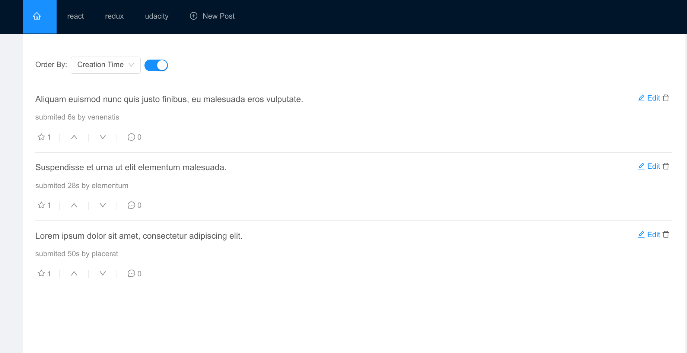
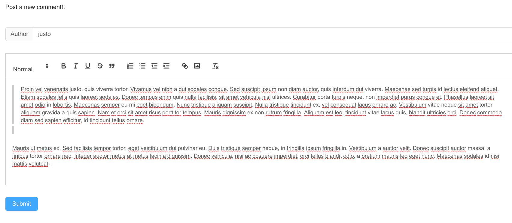
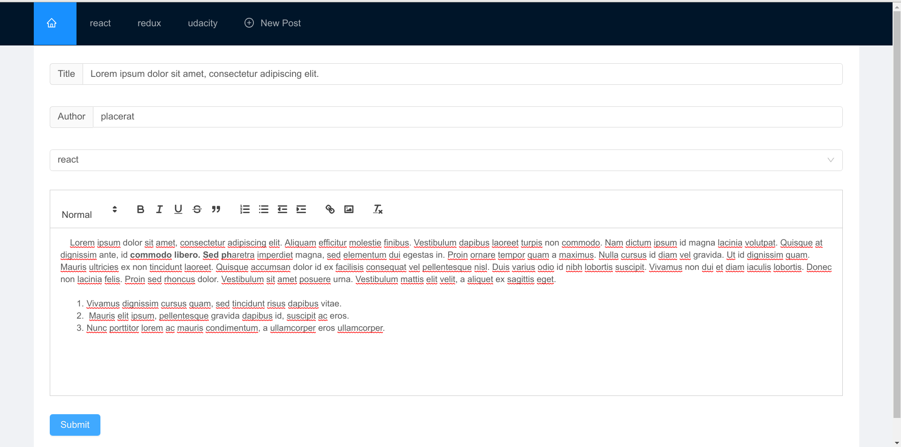

#  Project Readable

## Project Purpose

This project was built for the **Nanodegree React Developer**. The purpose of this project is to implement an application in React demonstrating knowledge and understanding about the structure of a React application in addition to using good programming practices in the implementation. The application consists of a reddit like application, where the user can post and comment posts, also vote on posts and comments.

## Installing and loading the App

To run the project it is necessary to have installed the Node> = 8.x and the package manager npm.

To clone and install the project dependencies, in the terminal use the commands:
```bash
   git clone https://github.com/chroniu/reactnd-project-readable-starter
   cd reactnd-project-readable-starter
   cd api-server
   npm install
   cd ..
   cd readable-app
   npm install
```

With the dependencies installed, first start the api server:
```bash
   cd api-server
   npm start
```

After, start the application:
```bash
   cd readable-app
   npm start
```

The application server will be initialized and the application will be accessible at the address given in the output of the previous command. Usually it will be accessible at: [http://localhost:3000].

## Instructions

The application allows:
- Posts
  - Create, update and delete posts;
  - rich-text post style
  - vote post
  - down vote post
  - order posts by timestamp, votes and comments
  - comment on a post
- Comments
  - Create, update and delete comments;
  - rich-text commentstyle
  - vote comment
  - down vote comment
  - reply a comment

Some screenshots of the aplication:










## Extra libraries 

This project used the following extra libraries:
 - antd
 - redux-logger
 - redux-logic
 - uuid
 - react-render-html
 - react-quill
 
 


